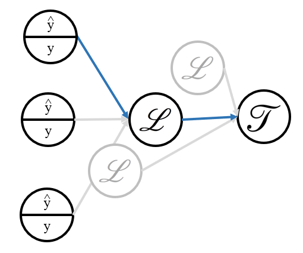
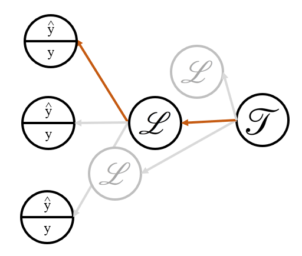
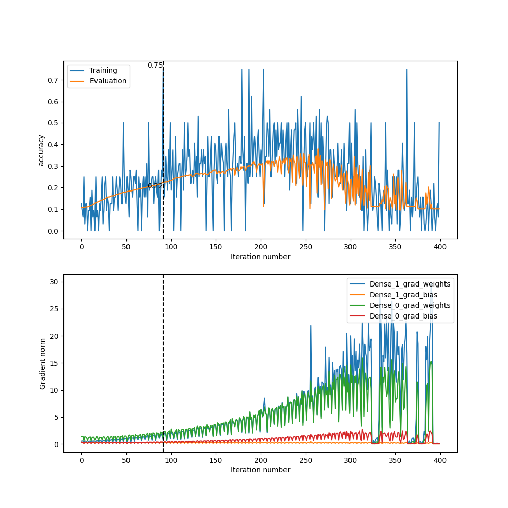
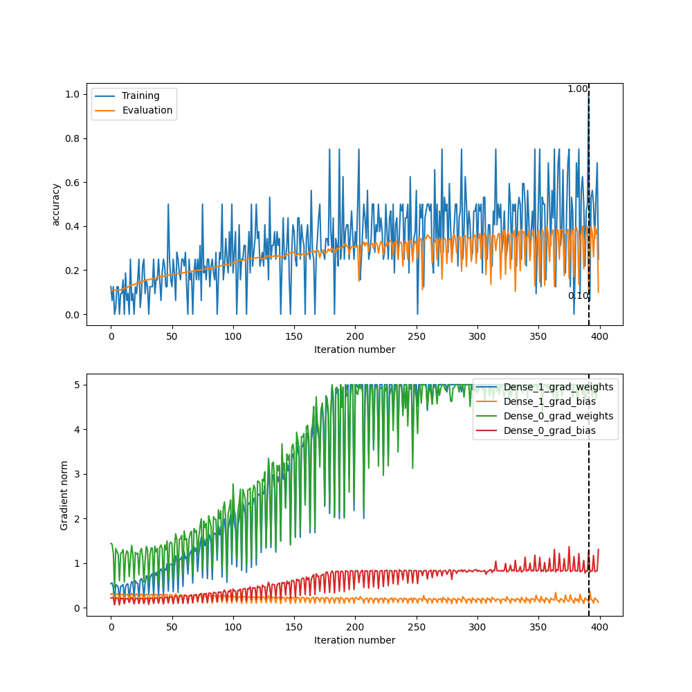

# diy-dnn

"What I cannot create, I do not understand"... the blackboard scrawl that launched a thousand neural-network-from-scratch projects. This being one of them (I'll spare you the Medium article though)...

Implementation of a neural network library from scratch, using Numpy, and a subsequent application on the MNIST dataset. The library aims to follow design patterns from Keras (e.g. Layers objects), as well as Trax (e.g. training/evaluation Task and Loop objects).

Weights & Biases project: https://wandb.ai/tom-walker-univ/mnist-classification-from-scratch

A detailed discussion on the development and performance of the library on the MNIST dataset is in section 4, below.

Personal notes on layer forward/backward equations, and the matrix calculus conventions followed, below in sections 1 and 3.

## 1. Summary

### 1.1.1 Layers

| Layer | Implemented | Forward *(element-wise)* | Forward *(matrix form)* | Backward *(element-wise)* | Backward *(matrix form)* |
| :---: | :---: | :---: | :---: | :---: | :---: |
| Dense | ✓ | $z_{ik}^l = \sum_j{w_{ij}^l a_{jk}^{l-1}} + b_{i}^l$ | $\mathbf{Z}^l = \mathbf{W}^l \cdot \mathbf{A}\^{l-1} + \mathbf{b}^l$ | $$da_{jk}^{l-1} = \sum_i{dz_{ik}^{l} \cdot w_{ij}}$$ <br> $$dw_{ij} = (1/m) * \sum_k{dz_{ik}^{l} \cdot a_{kj}^{l-1}}$$ <br> $$db_{i} = (1/m) * \sum_k{dz_{ik}^{l}}$$ | $$d\mathbf{A}^{l-1} = \mathbf{W}^T \cdot d\mathbf{Z}^{l}$$ <br> $$d\mathbf{W}^{l} = (1/m) * d\mathbf{Z}^l \cdot \mathbf{A}^{l-1, T}$$ <br> $$d\mathbf{b}^{l} = (1/m) * d\mathbf{Z}^l \cdot \mathbf{1}$$ |
| ReLU | ✓ | $a_i = Relu(z_i)$ | $\mathbf{A} = Relu(\mathbf{Z})$ | $dz_i = 0, z_i < 0$ <br> $dz_i = da_i, z_i >= 0$ | $d\mathbf{Z} = Relu'(d\mathbf{A})$ |
| Softmax | ✓ | $$a_i = \frac{e^{z_i}}{\sum_{j} e^{z_j}}$$ | $$\mathbf{A} = \frac{\exp(\mathbf{Z})}{\mathbf{1}^T \cdot \exp(\mathbf{Z})}$$ | $$dz_j = \sum_i{da_i \frac{\partial a_i}{\partial z_j}}$$ <br> $\rightarrow$ <br> $$dz_j = \sum_i{da_i \cdot (a_i \cdot (\delta_{ij} - a_j))}$$ | $$d\mathbf{Z} = d\mathbf{A} \cdot \mathbf{D}$$ <br> where $\mathbf{D}$ is Jacobian with differing elements on- and off- diagonal|
| BatchNorm | ✓ | $$\hat{z}_{ik} = \frac{{z_i}_k - \mu({z_j}_k)}{\sqrt{\sigma({z_j}_k)^2 + \epsilon}}$$ <br> $${a_i}_k = \gamma_i {\hat{z}_i}_k + \beta_i$$ | $$\hat{\mathbf{Z}} = \frac{\mathbf{Z} - \mu}{\sqrt{\mathbf{\sigma}^2 + \epsilon}}$$ <br> $$\mathbf{A} = \mathbf{\gamma} \odot \hat{\mathbf{Z}} + \mathbf{\beta}$$ | $$d\gamma_i = \sum_{k, samples}{da_{ik} \cdot \hat{z_{ik}}}$$ <br> $$d\beta_i = \sum_{k, samples}{da_{ik}}$$ <br> $$d\hat{z_{ik}} = da_{ik} \cdot \gamma_i$$ | $$d\mathbf{\gamma} = (d\mathbf{A} \odot \hat{\mathbf{Z}}) \cdot \mathbf{1}_m$$ <br> $$d\mathbf{\beta} = d\mathbf{A} \cdot \mathbf{1}_m$$ <br> $$d\hat{\mathbf{Z}} = d\mathbf{A} \odot \gamma$$ <br> $$d\mathbf{Z} = \frac{1}{m} \gamma \odot (\sigma^2 + \epsilon)^{-1/2} \left( -d\gamma \odot \hat{\mathbf{Z}} + m d\mathbf{A} - d\beta \right)$$ |
| (Cost) Categorical cross-entropy | ✓ | $$J = -\frac{1}{m} \sum_{j, samples}^m{\sum_{i, logits}^n{y_{ij} * \log{\hat{y_{ij}}}}}$$ | $$J = -\frac{1}{m} \text{Tr}(\mathbf{Y}^T \cdot \log(\mathbf{\hat{Y}}))$$ <br> Where $\text{Tr}$ is the Trace function. Alternatively: <br> $$J = -\frac{1}{m} \mathbf{1}_n^T \cdot (\mathbf{Y} \odot \log(\mathbf{\hat{Y}}))\cdot \mathbf{1}_m$$ | $$\hat{y_{ij}} = -\frac{1}{m} \frac{y_{ij}}{\hat{y}_{ij}}$$ | $$J = -\frac{1}{m} (\mathbf{Y} \oslash \mathbf{\hat{Y}})$$ <br> Where $\oslash$ is element-wise division |

| Layer | Forward | Backward |
| :---: | :---: | :---: |
| Dense |  |  |
| | Note: in diagram above, orthogonal "sample" dimension is not shown - but it is tracked in the above equation table, by subscript *k* | Care needs to be taken when calculating weight gradient, as it is either a vector-by-matrix partial derivative for one sample, or matrix-by-matrix p.d. for a mini-batch. Keeping in mind required shapes helps navigate various conventions. (1/m) term included, as gradients are summed across all samples - the (1/m) term makes this an average, and means the backprop step is roughly independent of batch-size |
| Relu |  |  |
| | - Introduces non-linearity <br> - Avoids vanishing gradient problem (unlike sigmoid activations) <br> - Simple gradient calculation | Backprop equation is almost the same as the forward prop equation once the chain rule has been applied (trans-layer derivative applied as product to (backprop) input activation derivative da_i, except that the conditions on layer being 0 or da_i depend on forward input z_i |
| Softmax |  |  |
| | Softmax is the traditional output layer for multi-class categorisation networks. The denominator ensures the sum of all outputs is 1, so the outputs can be interpreted as probabilities for each class. Exponentiation accentuates the difference between the input logits so that larger values are amplified | NB.1: Jacobian required due to interconnected denominator in forward eqn <br> NB.2: Matrix multiplication across all input grad activations connected to grad pre-activation (see diagram) |
| BatchNorm |  |  |
| | Mean *mu* and standard deviation *sigma* are both functions of all samples for a certain input feature (in my convention, they are calculated across the rows of the input matrices). This leads to difficulties when calculating the backpropagation equations. <br> Batch normalisation helps counter the vanishing/exploding gradients problem | Cheated here and didn't derive from first principles. Instead followed along derivation and implemented from: <br> https://chrisyeh96.github.io/2017/08/28/deriving-batchnorm-backprop.html |
| (Cost) Categorical cross-entropy |  |  |
| | Cost is implemented in a separate script (`costs_and_metrics`), but it is implemented as a network layer, with forward and backward methods | Scalar-by-matrix derivative (for mini-batch matrices Y and Yhat), so gradient is a matrix with same shape as Y / Yhat |

### 1.1.2 Optimisers

| Optimiser | Implemented | Equation | Explanation |
| :---: | :---: | :---: | :---: |
| (Mini-batch) SGD | ✓ | $$\mathbf{W} \leftarrow \mathbf{W} + \alpha d\mathbf{W}$$ | Simplest |
| Adam |  | $\mathbf{M_t} = \beta_1 * \mathbf{M_{t-1}} + (1 - \beta_1) * d\mathbf{W}$ <br> $\mathbf{V_t} = \beta_2 * \mathbf{V_{t-1}} + (1 - \beta_2) * d\mathbf{W}$ <br> $\hat{\mathbf{M_t}} \/= (1 - \beta_1)$ <br> $\hat{\mathbf{V_t}} \/= (1 - \beta_2)$ <br> $$\mathbf{W} \leftarrow \mathbf{W} - \frac{\alpha \cdot \hat{\mathbf{M}}_t}{\sqrt{\hat{\mathbf{V}}_t} + \epsilon}$$ | Faster convergence due to adaptive learning rates where learning rates for each parameter are proportional to their historical magnitude; faster convergence too via bias correction, where initial values are not overly biased |
| AdamW | | As Adam but: <br> 1. $d\mathbf{W} \leftarrow d\mathbf{W} + \lambda \mathbf{W}$ <br> 2. $\mathbf{W} \leftarrow \mathbf{W} - \frac{\alpha \cdot \hat{\mathbf{M}}_t}{\sqrt{\hat{\mathbf{V}}_t} + \epsilon} + \lambda \mathbf{W}$ | Plays better with L2 regularisation than Adam (similar to SGD) which is good for model generalisability. Retains training speed benefits of Adam |

### 1.1.3 Weight initialisers

| Initialiser | Implemented | Equation | Explanation |
| :---: | :---: | :---: | :---: |
| Random | ✓ | $$(w_{ij}^l)^{t=0} \sim \mathcal{N}(0, 1)$$ | Simple baseline implementation |
| He | ✓ | $$(w_{ij}^l)^{t=0} \sim \mathcal{N}(0, C)$$ <br> Where $C$ is the number of neurons in the previous activation layer | Helps with vanishing gradient problem |

### 1.1.4 Miscellaneous techniques

| Technique | Implemented | Equation | Explanation |
| :---: | :---: | :---: | :---: |
| Clip-norm | ✓ | $\| \mathbf{W} \|_2 \leftarrow \max(\| \mathbf{W} \|_2, 5)$ | Brute-force way to avoid exploding gradients. Note: the equation to the right contains the specific threshold value found to be useful for my application on MNIST |

## 2. Usage
1. Define architectures and train on MNIST dataset in `.../experiments/mnist_classification_train_and_validate.py`
  1. `DATA_CACHE_DIR`, `PLOTS_DIR` and `MODEL_CHECKPOINTS_DIR` define the directories for saving training/validation loop artefacts
  2. `RUN_SETTINGS` is a list of dictionaries. Each element of the list is a neural net architecture (allowing training and validation of several candidate architectures). Each dictionary defines both the neural net `"architecture"`, and training loop settings.
2. Post-process runs in `.../experiments/mnist_classification_evaluate.py`
  1. (Script has similar global parameters to set as `...train_and_validate`)
  2. Generates a summary log of metrics for all runs included
  3. Generates a visualisation of sample MNIST inferences for the trained model (on the validation set)

## 3. Matrix Calculus Cheat-sheet

### 3.1. Numerator-layout convention
* Given the following input objects...
    * $x, y$: Scalars
    * $\mathbf{x}, \mathbf{y}$: Column vectors, sizes respectively (n, 1), (m, 1)
    * $\mathbf{X}, \mathbf{Y}$: Matrices, sizes respectively (n, m), (p, q)
* ...the following derivatives (with dimensions) are possible:
  
| Operation                          | Output Type        | Output Shape                                            |
|-----------------------------------|--------------------|---------------------------------------------------------|
| $\frac{\partial y}{\partial x}$   | scalar-by-scalar   | Scalar output (size 1)                                 |
| $\frac{\partial \mathbf{y}}{\partial x}$ | vector-by-scalar | Column vector output (same shape as $\mathbf{y}$)     |
| $\frac{\partial y}{\partial \mathbf{x}}$ | scalar-by-vector | Row vector output (same shape as $\mathbf{x}^T$)    |
| $\frac{\partial \mathbf{y}}{\partial \mathbf{x}}$ | vector-by-vector (Jacobian) | Matrix output (shape (n, m) i.e. num rows of $\mathbf{y}$ and num columns of $\mathbf{x}^T$) |
| $\frac{\partial \mathbf{Y}}{\partial x}$ | matrix-by-scalar   | Matrix output, same shape as input matrix $\mathbf{Y}$ (n, m) |
| $\frac{\partial y}{\partial \mathbf{X}}$ | scalar-by-matrix   | Matrix output, same shape as transpose of denominator matrix (same shape as $\mathbf{X}^T$, i.e. (q, p)) |

After compiling these equations, found the following resource, which is quite useful for the nuances of matrix calculus for machine learning: https://www.overleaf.com/project/5c2af0744a493c1181d1b2da
 
### 3.2. Cost derivative abbreviation
Following the standard machine-learning abbreviation of the cost. 
* Given:
    * Scalar cost, $J$
    * Any neural network layer object, generally a vector e.g. $\mathbf{z}$ or matrix e.g. $\mathbf{W}$
* A partial differential of the cost w.r.t the network object, e.g. $\frac{\partial J}{\partial \mathbf{z}}$, can be abbreviated $d\mathbf{z}$
* Following the numerator-layout convention above, the non-scalar properties in the denominator should be transposed, e.g. if $\mathbf{Z}$ has shape $(n, m)$ then $d\mathbf{Z}$ would have shape $(m, n)$
* **However, while bearing the above convention in mind when working out calculations, a-posteriori apply a further transformation if necessary to final (backprop) equations, so that arrays and their gradients have the same dimensions**  

#### 3.2.1. Work-through with a specific example

<p align="center">
  
</p>

Working on the (specific) left-hand-side diagram
(Dropping layer superscripts, i.e. assuming $\mathbf{z}^1 = \mathbf{z}$ and $\mathbf{a}^0 = \mathbf{a}$)

```math
\begin{pmatrix}
z_0 \\
z_1
\end{pmatrix} = \begin{pmatrix}
    w_{00} & w_{01} & w_{02} \\
    w_{10} & w_{11} & w_{12}
\end{pmatrix} \cdot \begin{pmatrix}
a_0 \\
a_1 \\
a_2
\end{pmatrix}
```

(For the specific output neuron whose contributing edges (weights) are outlined in blue, the equation is $z_0 = w_{00}a_0 + w_{01}a_1 + w_{02}a_2$)

<p align="center">
  
</p>

Super-specific (specific unit calculation - relevant weight edges in red):
$$da_0 = w_{00}dz_0 + w_{10}dz_1$$

Specific (left-hand diagram, specific dense layout).

*First, following the numerator-layout convention, which has scalar-by-vector derivatives transpose the original vector parameter's shape:*

```math
\begin{pmatrix}
  da_0 & da_1 & da_2
\end{pmatrix} = \begin{pmatrix}
  dz_0 & dz_1
\end{pmatrix} \cdot \begin{pmatrix}
    w_{00} & w_{01} & w_{02} \\
    w_{10} & w_{11} & w_{12}
\end{pmatrix}
```

*Then, as per bold point in 3.2., applying further transformation to keep parameters and their gradients the same shape:*

```math
\begin{pmatrix}
  da_0 \\
  da_1 \\
  da_2
\end{pmatrix} = \begin{pmatrix}
    w_{00} & w_{10} \\
    w_{01} & w_{11} \\
    w_{02} & w_{12}
\end{pmatrix} \cdot \begin{pmatrix}
  dz_0 \\
  dz_1
\end{pmatrix}
```
*or:*
$$d\mathbf{a} = \mathbf{W}^T \cdot d\mathbf{z}$$


## 4. Results

In the discussion below, the starting architecture was a shallow neural network of a single Dense Layer of 50 neurons.

### 4.1. The effect of ClipNorm

An initial run of a simple, shallow neural network, was run on a limited sample of the MNIST training data (100 samples) for a quick initial experiment with using the package. This exhibited clear signs of exploding gradients, with the training loop cost/accuracies initially going in the right direction, before the cost exploding past 10, and the accuracy flatlining at 10% (random guessing for the 10-digit MNIST dataset). Plotting the magnitudes of the gradients allowed an immediate diagnosis of exploding gradients.

A first remedy for this was ClipNorm, which measures the norm of the gradients during back-propagation, and if they exceed a threshold, "clipping" them by renormalising so that the norm is the threshold. A norm threshold of 5 was selected, looking at the magnitudes of the gradients around the time the non-normalised training loop began to go south.

Below, on the LHS, the initial run without ClipNorm. On the RHS, with ClipNorm applied. It's a bit rough-and-ready, but it improves the situation markedly:

<table>
  <tr>
    <td>
      
    </td>
    <td>
      
    </td>
  </tr>
</table>

### 4.2. Training divergence on a larger dataset

After the clipnorm fix, dataset was expanded from the preliminary 100-sample set to the full 60000/10000 train/test MNIST dataset. The subsequent training loop again showed problems with training stability and a cost which shot upwards, after an initial promising trend.

In the figure below, training on the full dataset is in green (with zoomed-in graph showing promising early trend). Compared against the same architecture, trained on the 100-sample dataset, in red.

<p align="center">
  
</p>

### 4.3. Batch normalisation layers

In an effort to further improve training stability, and avoid any issues from exploding gradients, a BatchNorm Layer was implemented in the library, and added to the existing architecture (shallow NN of a single Dense Layer of 50 neurons). This markedly improved the situation - long-term exploding cost values are now avoided, and training the neural network is a lot more stable. There are still some transient periods where the cost value shoots up (further investigation required), but after these periods, the network quickly recovers its best-so-far state.

The best evaluation accuracy for this network on the MNIST dataset is 75%.

In the figure below, green is without batch normalisation, violet is with batch normalisation:

<p align="center">

</p>

### 4.4. Different architectures

With a network which now achieves reasonable accuracy, and a workable training stability, on the MNIST dataset (albeit with yet-to-be-explained transient mood swings), a quick scan of different architectures was performed.

| Graph Colour | Neural Network Architecture Description |
| ----------- | -------------------------------------- |
|  | Description of the neural network architecture for red |
|  | Description of the neural network architecture for blue |
|  | Description of the neural network architecture for green |

