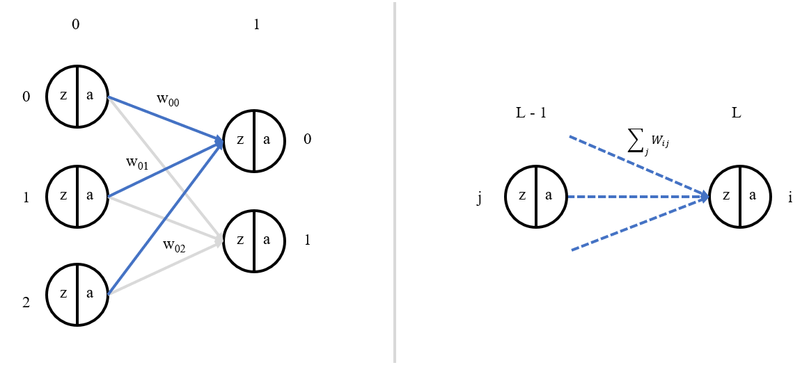
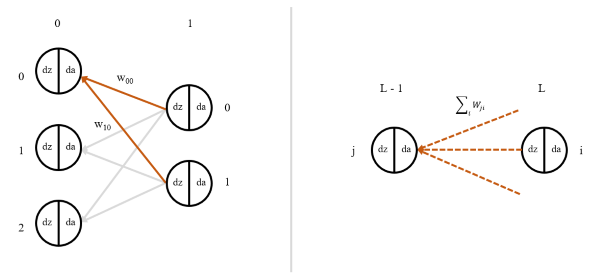
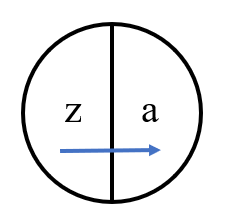
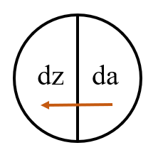
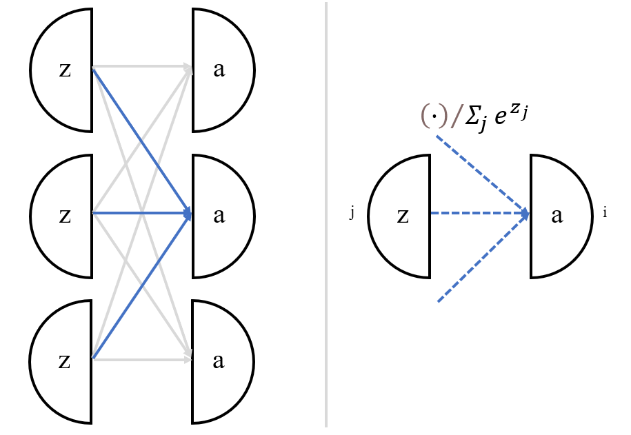
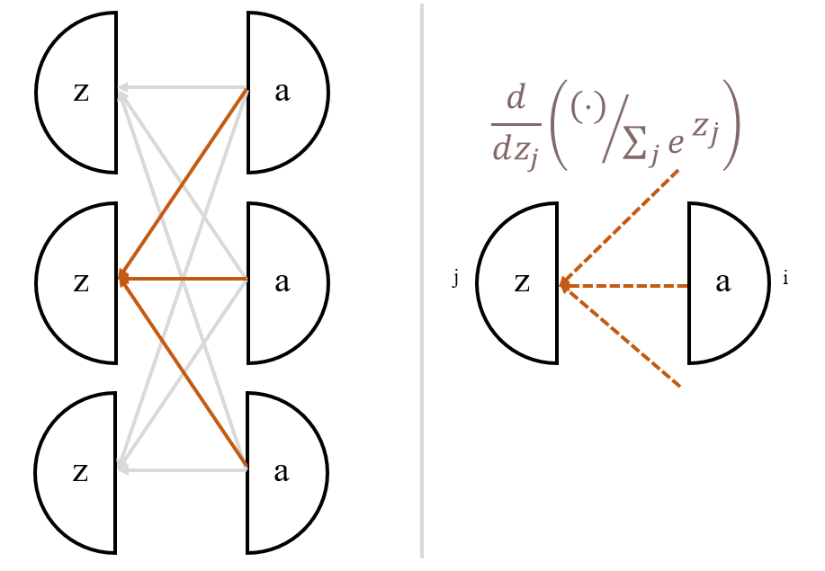
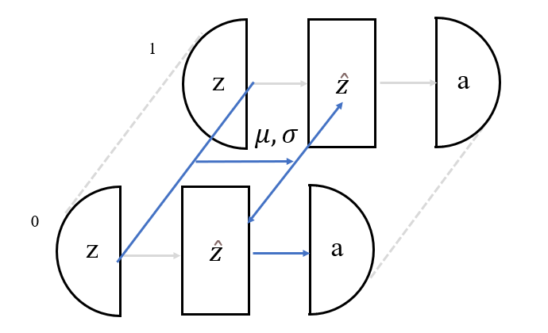
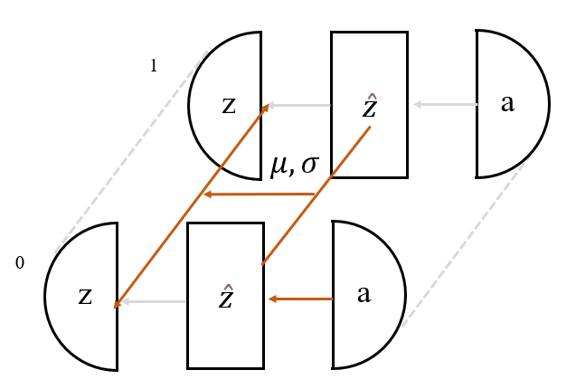

# diy-dnn
Simple NumPy feed-forward neural network library from scratch. Applied to MNIST dataset classification task.

## 1. Summary

### 1.1.1 Layers

| Layer | Implemented | Forward *(element-wise)* | Forward *(matrix form)* | Backward *(element-wise)* | Backward *(matrix form)* |
| :---: | :---: | :---: | :---: | :---: | :---: |
| Dense | ✓ | $z_i^l = \sum_j{w_{ij}^l a_j^{l-1}} + b_i^l$ | $\mathbf{Z}^l = \mathbf{W}^l \cdot \mathbf{A}\^{l-1} + \mathbf{b}^l$ | $$da_j^{l-1} = \sum_i{dz_i^{l} \cdot w_{ij}}$$ | $$d\mathbf{A}^{l-1} = \mathbf{W}^T \cdot d\mathbf{Z}^{l}$$ |
| ReLU | ✓ | $a_i = Relu(z_i)$ | $\mathbf{A} = Relu(\mathbf{Z})$ | $dz_i = 0, z_i < 0$ <br> $dz_i = da_i, z_i >= 0$ | $d\mathbf{Z} = Relu'(d\mathbf{A})$ |
| Softmax | ✓ | $$a_i = \frac{e^{z_i}}{\sum_{j} e^{z_j}}$$ | $$\mathbf{A} = \frac{\exp(\mathbf{Z})}{\mathbf{1}^T \cdot \exp(\mathbf{Z})}$$ | $$dz_j = \sum_i{da_i \frac{\partial a_i}{\partial z_j}}$$ <br> $\rightarrow$ <br> $$dz_j = \sum_i{da_i \cdot (a_i \cdot (\delta_{ij} - a_j))}$$ | $$d\mathbf{Z} = d\mathbf{A} \cdot \mathbf{D}$$ <br> where $\mathbf{D}$ is Jacobian with differing elements on- and off- diagonal|
| BatchNorm | ✓ | $$\hat{x}_i = \frac{x_i - \mu(x_j)}{\sqrt{\sigma(x_j)^2 + \epsilon}}$$ <br> $$y_i = \gamma \hat{x}_i + \beta$$ | $$\hat{\mathbf{x}} = \frac{\mathbf{x} - \mu}{\sqrt{\mathbf{\sigma}^2 + \epsilon}}$$ <br> $$\mathbf{y} = \gamma \hat{\mathbf{x}} + \beta$$ | :---: | :---: |
| (Cost) Categorical cross-entropy | ✓ | xxx | xxx | :---: | :---: |
| Attention | | xxx | xxx | :---: | :---: |

| Layer | Forward | Backward |
| :---: | :---: | :---: |
| Dense |  |  |
| Relu |  |  |
| | - Introduces non-linearity <br> - Avoids vanishing gradient problem (unlike sigmoid activations) <br> - Simple gradient calculation | Backprop equation is almost the same as the forward prop equation once the chain rule has been applied (trans-layer derivative applied as product to (backprop) input activation derivative da_i, except that the conditions on layer being 0 or da_i depend on forward input z_i |
| Softmax |  |  |
| | Notes | NB.1: Jacobian required due to interconnected denominator in forward eqn <br> NB.2: Matrix multiplication across all input grad activations connected to grad pre-activation (see diagram) |
| BatchNorm |  |  |
| | Notes | Notes |
| (Cost) Categorical cross-entropy | | |
| | Notes | Notes |
| Attention | | |
| | Notes | Notes |

### 1.1.2 Optimisers

| Optimiser | Implemented | Equation | Explanation |
| :---: | :---: | :---: | :---: |
| (Mini-batch) SGD | ✓ |  |  |
| Adam | |  |  |
| AdamW | |  |  |

### 1.1.3 Weight initialisers

| Initialiser | Implemented | Equation | Explanation |
| :---: | :---: | :---: | :---: |
| Random | ✓ |  |  |
| He | ✓ |  |  |

### 1.1.4 Miscellaneous techniques

| Technique | Implemented | Equation | Explanation |
| :---: | :---: | :---: | :---: |
| Clip-norm | ✓ |  |  |

TEMP: check dense backprop (1/m) term

## 2. Usage
1. Define architectures and train on MNIST dataset in `.../experiments/mnist_classification_train_and_validate.py`
  1. `DATA_CACHE_DIR`, `PLOTS_DIR` and `MODEL_CHECKPOINTS_DIR` define the directories for saving training/validation loop artefacts
  2. `RUN_SETTINGS` is a list of dictionaries. Each element of the list is a neural net architecture (allowing training and validation of several candidate architectures). Each dictionary defines both the neural net `"architecture"`, and training loop settings.
2. Post-process runs in `.../experiments/mnist_classification_evaluate.py`
  1. (Script has similar global parameters to set as `...train_and_validate`)
  2. Generates a summary log of metrics for all runs included
  3. Generates a visualisation of sample MNIST inferences for the trained model (on the validation set)

## 3. Matrix Calculus Cheat-sheet

### 3.1. Numerator-layout convention
* Given the following input objects...
    * $x, y$: Scalars
    * $\mathbf{x}, \mathbf{y}$: Column vectors, sizes respectively (n, 1), (m, 1)
    * $\mathbf{X}, \mathbf{Y}$: Matrices, sizes respectively (n, m), (p, q)
* ...the following derivatives (with dimensions) are possible:
  
| Operation                          | Output Type        | Output Shape                                            |
|-----------------------------------|--------------------|---------------------------------------------------------|
| $\frac{\partial y}{\partial x}$   | scalar-by-scalar   | Scalar output (size 1)                                 |
| $\frac{\partial \mathbf{y}}{\partial x}$ | vector-by-scalar | Column vector output (same shape as $\mathbf{y}$)     |
| $\frac{\partial y}{\partial \mathbf{x}}$ | scalar-by-vector | Row vector output (same shape as $\mathbf{x}^T$)    |
| $\frac{\partial \mathbf{y}}{\partial \mathbf{x}}$ | vector-by-vector (Jacobian) | Matrix output (shape (n, m) i.e. num rows of $\mathbf{y}$ and num columns of $\mathbf{x}^T$) |
| $\frac{\partial \mathbf{Y}}{\partial x}$ | matrix-by-scalar   | Matrix output, same shape as input matrix $\mathbf{Y}$ (n, m) |
| $\frac{\partial y}{\partial \mathbf{X}}$ | scalar-by-matrix   | Matrix output, same shape as transpose of denominator matrix (same shape as $\mathbf{X}^T$, i.e. (q, p)) |

 
### 3.2. Cost derivative abbreviation
Following the standard machine-learning abbreviation of the cost. 
* Given:
    * Scalar cost, $J$
    * Any neural network layer object, generally a vector e.g. $\mathbf{z}$ or matrix e.g. $\mathbf{W}$
* A partial differential of the cost w.r.t the network object, e.g. $\frac{\partial J}{\partial \mathbf{z}}$, can be abbreviated $d\mathbf{z}$
* Following the numerator-layout convention above, the non-scalar properties in the denominator should be transposed, e.g. if $\mathbf{Z}$ has shape $(n, m)$ then $d\mathbf{Z}$ would have shape $(m, n)$
* **However, while bearing the above convention in mind when working out calculations, a-posteriori apply a further transformation if necessary to final (backprop) equations, so that arrays and their gradients have the same dimensions**  

#### 3.2.1. Work-through with a specific example

<p align="center">
  
</p>

Working on the (specific) left-hand-side diagram
(Dropping layer superscripts, i.e. assuming $\mathbf{z}^1 = \mathbf{z}$ and $\mathbf{a}^0 = \mathbf{a}$)

```math
\begin{pmatrix}
z_0 \\
z_1
\end{pmatrix} = \begin{pmatrix}
    w_{00} & w_{01} & w_{02} \\
    w_{10} & w_{11} & w_{12}
\end{pmatrix} \cdot \begin{pmatrix}
a_0 \\
a_1 \\
a_2
\end{pmatrix}
```

(For the specific output neuron whose contributing edges (weights) are outlined in blue, the equation is $z_0 = w_{00}a_0 + w_{01}a_1 + w_{02}a_2$)

<p align="center">
  
</p>

Super-specific (specific unit calculation - relevant weight edges in red):
$$da_0 = w_{00}dz_0 + w_{10}dz_1$$

Specific (left-hand diagram, specific dense layout).

*First, following the numerator-layout convention, which has scalar-by-vector derivatives transpose the original vector parameter's shape:*

```math
\begin{pmatrix}
  da_0 & da_1 & da_2
\end{pmatrix} = \begin{pmatrix}
  dz_0 & dz_1
\end{pmatrix} \cdot \begin{pmatrix}
    w_{00} & w_{01} & w_{02} \\
    w_{10} & w_{11} & w_{12}
\end{pmatrix}
```

*Then, as per bold point in 3.2., applying further transformation to keep parameters and their gradients the same shape:*

```math
\begin{pmatrix}
  da_0 \\
  da_1 \\
  da_2
\end{pmatrix} = \begin{pmatrix}
    w_{00} & w_{10} \\
    w_{01} & w_{11} \\
    w_{02} & w_{12}
\end{pmatrix} \cdot \begin{pmatrix}
  dz_0 \\
  dz_1
\end{pmatrix}
```

*or:*
$$d\mathbf{a} = \mathbf{W}^T \cdot d\mathbf{z}$$


